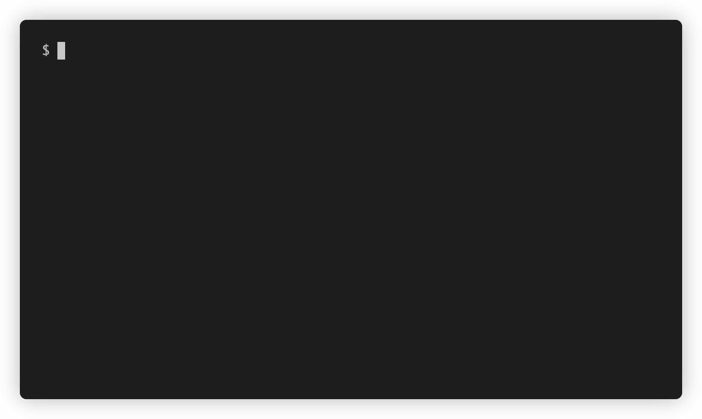

# Blackjack.js (engine)

Core game logic for a Blackjack basic strategy trainer. Includes a simple CLI game display.



## Goals

* Easy to play many hands quickly
* Basic strategy and card counting deviation hints
* No package dependencies
* Runs in Node or browser

## Build

```sh
npm install
npm run build
```

## Run game in CLI mode

```sh
npm start
```

## Use as a library in the browser

```js
// The following are default game settings:
const settings = {
  animationDelay: 200,
  deckCount: 2,
  allowSurrender: false,
  allowLateSurrender: false,
  checkDeviations: false,
  // Can be one of 'default', 'pairs', 'uncommon', 'illustrious18'.
  gameMode: 'default',
};

const game = new BlackjackEngine(settings);

// In a real app, this will likely be a React-redux store or a Vuex store.
const state = {};

// Called when any game state changes. Update your app's UI based on the
// following game state:
game.on('change', () => {
  if (game.state.focusedHand) {
    state.focusedHandId = game.state.focusedHand.id;
  }

  state.sessionMovesCorrect = game.state.sessionMovesCorrect;
  state.sessionMovesTotal = game.state.sessionMovesTotal;
  state.playCorrection = game.state.playCorrection;
  state.step = game.state.step;
  state.gameInternalSettings = game.settings;

  state.shoe = game.shoe.attributes();
  state.discardTray = game.discardTray.attributes();
  state.dealer = game.dealer.attributes();
  state.player = game.player.attributes();
  state.handWinner = game.state.handWinner;
});

game.on('shuffle', () => {
  console.log('End of shoe, cards shuffled!');
});

// Emitted when the engine wants to save optional game statistics.
// `entityName` can be one of `hand-result` or `move`.
// `data` is a plain object with values to save to the backend.
game.on('create-record', (entityName, data) => {
  fetch(`/api/v1/${entityName}`, {
    method: 'POST',
    body: JSON.serialize(data),
    headers: {
      Accept: 'application/json',
      'Content-Type': 'application/json',
    },
  });
});

async function startGame(game) {
  while (true) {
    try {
      await game.start();
    } catch (error) {
      if (error.message === 'Game reset') {
        continue;
      }

      throw error;
    }
  }
}

startGame(game);
```

The game often pauses and listens for a `click` or `keypress` event on
`document.body`. Your DOM just has to declare the following buttons somewhere
for user interaction:

```html
<template v-if="game.state.step === 'waiting-for-move'">
  <button data-action="s">Stand (S)</button>
  <button data-action="h">Hit (H)</button>
  <button data-action="d">Double (D)</button>
  <button data-action="r">Surrender (R)</button>
  <button data-action="p">Split (P)</button>
<template v-else-if="step === 'ask-insurance'">
  <button data-action="n">No (N)</button>
  <button data-action="y">Yes (Y)</button>
</template>
<template v-else>
  <button data-action="d">Deal (press any key)</button>
</template>
```
